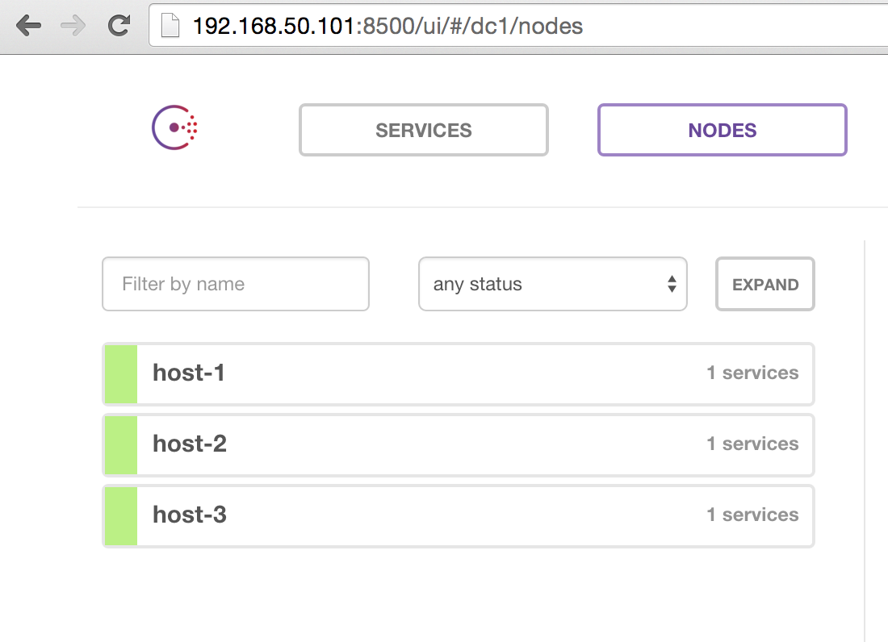

## Steps

* [Automated Provisioning](#automated-provisioning)
* [Automated Deployment](#automated-deployment)
* [Manual Provisioning](#manual-provisioning)
* [Manual Deployment](#manual-deployment)

### Automated Provisioning
Done once:
* Setting up the 3-node Consul cluster
* Installing Registrator on the 2 nodes that we will launch app containers on
* Set up 1 automatically-reconfiguring load balancer, per microservice

```
vagrant up
```

### Automated Deployment
Done each time there's a new version of the app:
* Download the latest version of the Docker image and start (or restart) >1 app container on a random available port. The load balancer automatically learns about it through Registrator -> Consul, and automatically rewrites its configuration via Consul Template.

```
maestro status
maestro pull && maestro restart # TODO: fix this
```

### Manual Provisioning

0. Bring up vagrant machines (generic Docker hosts)

    ```
    $ vagrant up
    $ vagrant status
    ```

0. SSH into each machine (`host-1`, `host-2`, `host-3`) and verify they each have a unique IP address in the private network

    ```bash
    $ vagrant ssh host-1

    host-1$ ifconfig eth1 | grep 'inet addr:' | cut -d: -f2 | awk '{ print $1}'

    192.168.50.101
    ```

    Note that `192.168.50.101` is actually hardcoded in the Vagrantfile to make these steps deterministic! Feel free to adjust the Vagrantfile as needed.

0. On `host-1`, start Consul and Registrator

    ```bash
    # start consul
    host-1$ $(docker run --rm gliderlabs/consul:legacy cmd:run 192.168.50.101 -d -v /mnt:/data)

    host-1$ export HOST_IP=$(ifconfig eth1 | grep 'inet addr:' | cut -d: -f2 | awk '{ print $1}')

    # start registrator
    host-1$ docker run -d --name=registrator --net=host --volume=/var/run/docker.sock:/tmp/docker.sock gliderlabs/registrator:latest consul://$HOST_IP:8500
    ```

0. On `host-2`, run the same commands as on `host-1` except for Consul, you must specify a join IP (or else it will start a new Consul cluster instead of joining the existing one!)

    See the [README for gliderlabs/consul](https://github.com/gliderlabs/docker-consul/tree/legacy#runner-command) for more info. **NOTE:** README says to use `JOIN_IP::CURRENT_IP` syntax, but the correct syntax appears to be `CURRENT_IP:JOIN_IP`, weird...

    ```bash
    host-2$ export HOST_IP=$(ifconfig eth1 | grep 'inet addr:' | cut -d: -f2 | awk '{ print $1}')

    host-2$ echo $HOST_IP

    192.168.50.102

    # join existing consul cluster
    host-2$ $(docker run --rm gliderlabs/consul:legacy cmd:run 192.168.50.102:192.168.50.101 -d -v /mnt:/data)

    # start registrator
    host-2$ docker run -d --name=registrator --net=host --volume=/var/run/docker.sock:/tmp/docker.sock gliderlabs/registrator:latest consul://$HOST_IP:8500
    ```

    Another point worth mentioning is the Productionized special runner command listed above expects 3 nodes to exist before attempting to bootstrap the cluster. There's some way to override this via env vars, but if you're tailing the logs `$ docker logs -f consul` you'll see failures all the way until `host-3` joins the cluster.

0. On `host-3`, start Consul and the DR-CoN container

    ```bash
    $ vagrant ssh host-3

    host-3$ export HOST_IP=$(ifconfig eth1 | grep 'inet addr:' | cut -d: -f2 | awk '{ print $1}')

    host-3$ echo $HOST_IP

    192.168.50.103

    # last node needed to bootstrap consul cluster
    host-3$ $(docker run --rm gliderlabs/consul:legacy cmd:run 192.168.50.103:192.168.50.101 -d -v /mnt:/data)

    # start nginx & consul template
    host-3$ docker run -it -e "CONSUL=$HOST_IP:8500" -e "SERVICE=flask-nanoservice" -p 80:80 smoll/dr-con
    ```

0. At this point, it's a good idea to verify the Consul cluster is healthy, and has 3 nodes total. There's a web UI that we can use to easily verify this: http://192.168.50.101:8500

    

#### Manual Deployment

0. On `host-1`, let's bring up one instance of the microservice, naming it `flask-nanoservice`, on a random port (note the `-P`). In practice, this can be easily automated with Centurion or MaestroNG.

    ```bash
    host-1$ docker run -d -e "SERVICE_NAME=flask-nanoservice" -P smoll/flask-nanoservice

    host-1$ docker port 9adcffb51d1c

    5000/tcp -> 0.0.0.0:49153
    ```

    Note that within the private network I can now hit this service on the ephemeral port:

    ```bash
    $ curl http://172.28.128.6:49153

    Hello World from 9adcffb51d1c
    ```

    This isn't publicly accessible on the Internet, though.

0. The load balancer should now know about the container on `host-1`.

    ```bash
    $ curl http://192.168.50.103

    Hello World from c644a63ac0b3

    $ curl http://192.168.50.103

    Hello World from c644a63ac0b3
    ```

    As expected, two successive curl calls return replies from the one and only app container.

0. Bring up a second instance of the microservice on `host-2`.

    ```bash
    host-2$ docker run -d -e "SERVICE_NAME=flask-nanoservice" -P smoll/flask-nanoservice
    ```

0. The load balancer should now round-robin between the two containers.

    ```bash
    $ curl http://192.168.50.103

    Hello World from c644a63ac0b3

    $ curl http://192.168.50.103

    Hello World from 66c594619b09

    $ curl http://192.168.50.103

    Hello World from c644a63ac0b3
    ```

### Cleanup

At any point, to clean up all the Docker containers on a Vagrant VM

```
docker rm -f $(docker ps -aq)
```

To completely destroy all VMs (so you can start from scratch, free up IPs, or release mem/CPU used by the VMs)

```
vagrant destroy -f
```
